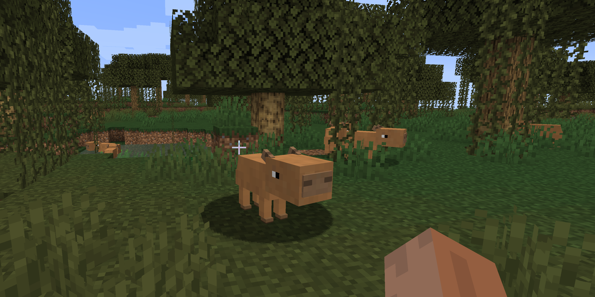

# Fabric ModFest 2020: Chill Capybara Commune!
   
##Features
- A mod featuring Capybara's
- Capybara's passivy mobs in a radius
- Eat bark and grass
- Custom Hotspring feature (swamp)
- Custom recipes
- Capybara's spawn in the swamp biome near the vicinity of a hotspring
 <!---->
 
## Setup
1. Run the following command:
```
./gradlew idea 
```

## License

This template is available under the CC0 license. Feel free to learn from it and incorporate it in your own projects.


